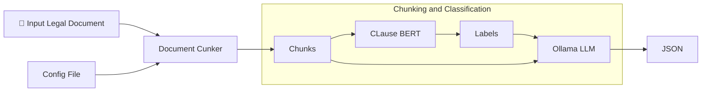

# ClauseLens

## Description
ClauseLens is an AI system for automatically reviewing legal contracts. It identifies legally-relevant parts of a document, rewriting them to comply with an internal policy.

## Tech stack
- Langchain
- Ollama
- NLTK
- ONNX
- FastAPI
- [ClauseBERT](https://github.com/weiss25r/ClauseBERT)

## Quick start
First, install all dependencies, set up [Ollama](https://docs.ollama.com/quickstart$0) and download ClauseBERT ONNX files from [HuggingFace](https://huggingface.co/raffaele-terracino/ClauseBERT), setting its path in ```config/config.json```. In the same file, you can specify the policy contracts should be compliant with and the Ollama **LLM** to be used. Ensure that the Ollama service is running and the specified model has been pulled. You can then run the API by executing:
```bash
fastapi run app/app.py
```
and then POST a **PDF** or **txt** file.

Alternatively, you can use the CLI by running:
```bash
python main.py -f path_input_document -o path_output_json
```

## Project Structure
```text
├── app
│   └── app.py              #FastAPI endpoint
├── configs/    
│   └── config.json.        #JSON system config file          
├── src/                    # Core source code
│   ├── agent.py            # Langchain and Ollama integration
│   ├── chunker.py          # Document Chunker
│   ├── classifier.py       # ONNX classifier inference
│   └── clens.py            # System pipeline
├── .gitattributes
├── .gitignore
├── LICENSE
└── main.py                 # CLI interface
└── README.md
└── requirements.txt
```

## System overview
ClauseLens uses the ClauseBERT classifier and a open-source LLM via Ollama. A document, in PDF or TXT format, is first read and divided into **chunks** of fixed size. Chunk size is an hyperparameter of the system, balancing the trade off between speed and accuracy, and can be specified in the config file.

Chunking is done by first reading the entire document, segmenting it into sentences using the NLTK sentence tokenizer and then creating chunk by concatenating sentences until the maximun chunk size is reached.

Chunks are then classified by ClauseBERT in one of 10 possible categories (9 legal classes + 1 class "Other"), using the ONNX runtime.

Each chunk of legal category is then passed to the LLM, which outputs a JSON containing a list in which each element has the following keys:
- paragraph;
- reasons; where the LLM explains wether and why the paragraph is compliant with its policy;
- corrections, where the model provides the rewritten, policy-compliant paragraph;

**The LLM performs the task zero-shot**.

The chart belows illustrated the pipeline.


## Acknowledgments
All rights belong to the authors of the [Contract Understanding Atticus Dataset](https://huggingface.co/datasets/theatticusproject/cuad/tree/main/CUAD_v1$0). The dataset is licensed by a CC-BY 4.0 license.


ClauseLens was made as part of the final exam of the Natural Language Processing course @ University of Catania.
